.. _tutorial:

Chemistry Tutorial
==================

This tutorial shows how to compute chemistry with ``chemcat`` under
different assumptions for temperature, metallicity, and custom elemental
abundances.
You can also find this tutorial as a `Python scrip here
<https://github.com/AtmoLib/chemcat/blob/main/docs/chemistry_tutorial.py>`_
or a `jupyter notebook here
<https://github.com/AtmoLib/chemcat/blob/main/docs/chemistry_tutorial.ipynb>`_.

Let’s start off importing the necessary modules and create an utility
function to plot the results:

.. code:: python

    import chemcat as cat
    import chemcat.utils as u
    import numpy as np

Basic Run
---------

``chemcat`` is an object-oriented code that keeps all the thermochemical
properties in place. In it most basic usage, all it requres is a
pressure-temperature profile and a list of species.

This creates a chemical network assuming solar elemental composition and
a simple CHNO compostion (taking values from Asplund et al. 2021):

.. code:: python

    # Setup:
    nlayers = 81
    temperature = np.tile(1200.0, nlayers)
    pressure = np.logspace(-8, 3, nlayers)
    molecules = 'H2O CH4 CO CO2 NH3 N2 H2 HCN OH C2H2 C2H4 H He C N O'.split()
    
    net = cat.Network(pressure, temperature, molecules)

.. code:: python

    # To compute thermochemical equilibrium abundances, run this method:
    vmr = net.thermochemical_equilibrium()

.. code:: python

    # and plot the results:
    title = f'T = {temperature[0]} K'
    ax = u.plot_vmr(pressure, vmr, net.species, title=title, fignum=10)

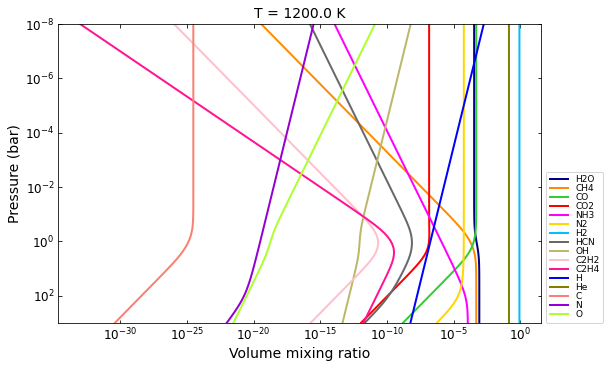

Evaluate at a different temperature
~~~~~~~~~~~~~~~~~~~~~~~~~~~~~~~~~~~

.. code:: python

    # Simply, provide a new temperature profile in the call:
    temp_2800K = np.tile(2800, nlayers)
    vmr = net.thermochemical_equilibrium(temperature=temp_2800K)
    
    title = f'T = {temp_2800K[0]} K'
    vmr_range = (1e-25, 3)
    ax = u.plot_vmr(pressure, vmr, net.species, vmr_range=vmr_range, title=title, fignum=20)

.. image:: chemistry_tutorial_files/chemistry_tutorial_7_0.png

Object’s data
~~~~~~~~~~~~~

The ``net`` object contains all the physical data of the atmosphere,
which you can query at any point:

.. code:: python

    print(f'Pressure profile (bar):\n{net.pressure}')
    print(f'\nTemperature profile (kelvin):\n{net.temperature}')
    
    print(f'\nElemental composition:\n{net.elements}')
    print('\nElemental abundances (normalized to H_abundance==1.0)'
          f'\n(same order as in the array above):\n{net.element_rel_abundance}')
    print(f'\nElemental composition source:\n{net.element_file}')
    
    print(f'\n\nMolecular composition:\n{net.species}')
    print(f'Source for each species thermochemical data:\n{net.provenance}')
    print(
        '\nStoichiometric values matrix for each species:'
        '\n(order of values goes according to order of elements and species arrays)'
        f'\n{net.stoich_vals}')

.. parsed-literal::

    Pressure profile (bar):
    [1.00000000e-08 1.37246096e-08 1.88364909e-08 2.58523484e-08
     3.54813389e-08 4.86967525e-08 6.68343918e-08 9.17275935e-08
     1.25892541e-07 1.72782598e-07 2.37137371e-07 3.25461783e-07
     4.46683592e-07 6.13055792e-07 8.41395142e-07 1.15478198e-06
     1.58489319e-06 2.17520403e-06 2.98538262e-06 4.09732110e-06
     5.62341325e-06 7.71791516e-06 1.05925373e-05 1.45378439e-05
     1.99526231e-05 2.73841963e-05 3.75837404e-05 5.15822165e-05
     7.07945784e-05 9.71627952e-05 1.33352143e-04 1.83020611e-04
     2.51188643e-04 3.44746607e-04 4.73151259e-04 6.49381632e-04
     8.91250938e-04 1.22320712e-03 1.67880402e-03 2.30409298e-03
     3.16227766e-03 4.34010264e-03 5.95662144e-03 8.17523038e-03
     1.12201845e-02 1.53992653e-02 2.11348904e-02 2.90068120e-02
     3.98107171e-02 5.46386550e-02 7.49894209e-02 1.02920053e-01
     1.41253754e-01 1.93865264e-01 2.66072506e-01 3.65174127e-01
     5.01187234e-01 6.87859912e-01 9.44060876e-01 1.29568670e+00
     1.77827941e+00 2.44061907e+00 3.34965439e+00 4.59726989e+00
     6.30957344e+00 8.65964323e+00 1.18850223e+01 1.63117291e+01
     2.23872114e+01 3.07255737e+01 4.21696503e+01 5.78761988e+01
     7.94328235e+01 1.09018449e+02 1.49623566e+02 2.05352503e+02
     2.81838293e+02 3.86812055e+02 5.30884444e+02 7.28618175e+02
     1.00000000e+03]
    
    Temperature profile (kelvin):
    [2800 2800 2800 2800 2800 2800 2800 2800 2800 2800 2800 2800 2800 2800
     2800 2800 2800 2800 2800 2800 2800 2800 2800 2800 2800 2800 2800 2800
     2800 2800 2800 2800 2800 2800 2800 2800 2800 2800 2800 2800 2800 2800
     2800 2800 2800 2800 2800 2800 2800 2800 2800 2800 2800 2800 2800 2800
     2800 2800 2800 2800 2800 2800 2800 2800 2800 2800 2800 2800 2800 2800
     2800 2800 2800 2800 2800 2800 2800 2800 2800 2800 2800]
    
    Elemental composition:
    ['C' 'H' 'He' 'N' 'O']
    
    Elemental abundances (normalized to H_abundance==1.0)
    (same order as in the array above):
    [2.88403150e-04 1.00000000e+00 8.20351544e-02 6.76082975e-05
     4.89778819e-04]
    
    Elemental composition source:
    /Users/user/envs/python36/chemcat/data/asplund_2021_solar_abundances.dat
    
    
    Molecular composition:
    ['H2O' 'CH4' 'CO' 'CO2' 'NH3' 'N2' 'H2' 'HCN' 'OH' 'C2H2' 'C2H4' 'H' 'He'
     'C' 'N' 'O']
    Source for each species thermochemical data:
    ['janaf' 'janaf' 'janaf' 'janaf' 'janaf' 'janaf' 'janaf' 'janaf' 'janaf'
     'janaf' 'janaf' 'janaf' 'janaf' 'janaf' 'janaf' 'janaf']
    
    Stoichiometric values matrix for each species:
    (order of values goes according to order of elements and species arrays)
    [[0 2 0 0 1]
     [1 4 0 0 0]
     [1 0 0 0 1]
     [1 0 0 0 2]
     [0 3 0 1 0]
     [0 0 0 2 0]
     [0 2 0 0 0]
     [1 1 0 1 0]
     [0 1 0 0 1]
     [2 2 0 0 0]
     [2 4 0 0 0]
     [0 1 0 0 0]
     [0 0 1 0 0]
     [1 0 0 0 0]
     [0 0 0 1 0]
     [0 0 0 0 1]]

Custom compositions
-------------------

There are a few alternatives evaluate thermochemical equilibrium for
different compositions

Custom metallicity
~~~~~~~~~~~~~~~~~~

Use the ``metallicity`` argument to set a custom metallicity relative to
solar (in dex units)

.. code:: python

    # E.g., solar metallicity (default):
    net = cat.Network(pressure, temperature, molecules)
    vmr_custom_solar = net.thermochemical_equilibrium(
        metallicity=0.0,
    )
    
    # e.g, 0.1x solar metallicity:
    vmr_custom_sub_solar = net.thermochemical_equilibrium(
        metallicity=-1.0,
    )
    
    # e.g, 50x solar metallicity:
    metallicity = np.log10(50.0)
    vmr_custom_super_solar = net.thermochemical_equilibrium(
        metallicity=metallicity,
    )
    
    
    # And plot the results:
    title = 'Custom sub solar metallicity (0.1x solar)'
    ax = u.plot_vmr(pressure, vmr_custom_sub_solar, net.species, title=title, fignum=30)
    
    title = 'Custom solar metallicity'
    ax = u.plot_vmr(pressure, vmr_custom_solar, net.species, title=title, fignum=31)
    
    title = 'Custom super solar metallicity (50x solar)'
    ax = u.plot_vmr(pressure, vmr_custom_super_solar, net.species, title=title, fignum=32)

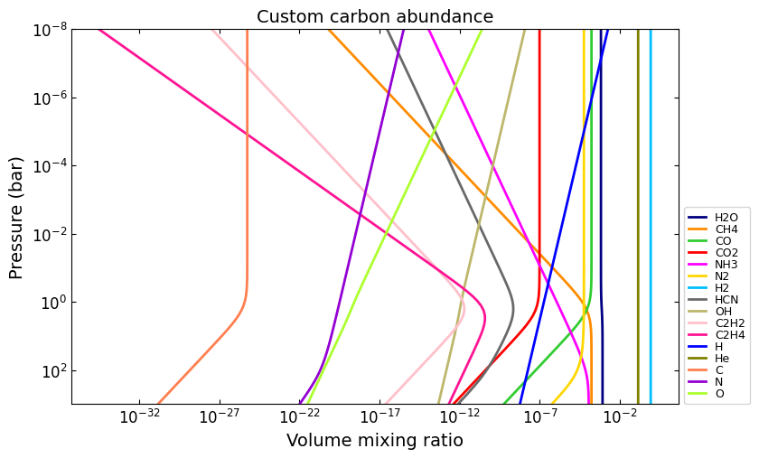

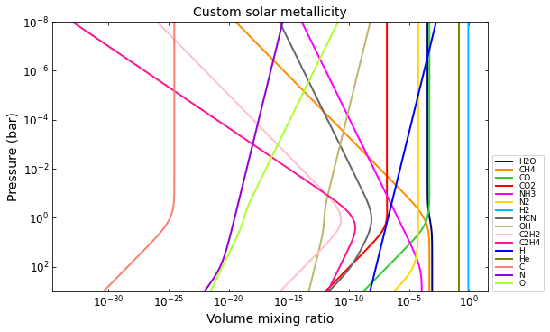

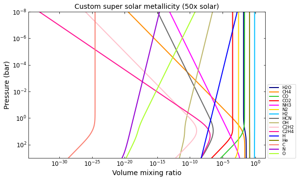

Note that once you modify a physical property, it stays modified until
you re-set it again:

.. code:: python

    print(f'[M/H] = {net.metallicity:.2f}')
    print(f'Elemental abundances:\n{net.element_rel_abundance}')
    
    # You can modify the properties directly:
    net.metallicity = 0.0
    print(f'\n[M/H] = {net.metallicity}')
    print(f'Elemental abundances:\n{net.element_rel_abundance}')
    
    # Or, you can modify the properties via a call:
    # e.g, 50x solar:
    vmr_custom_super_solar = net.thermochemical_equilibrium(
        metallicity=np.log10(50.0),
    )
    print(f'\n[M/H] = {net.metallicity:.2f}')
    print(f'Elemental abundances:\n{net.element_rel_abundance}')

.. parsed-literal::

    [M/H] = 1.70
    Elemental abundances:
    [0.01442016 1.         0.08203515 0.00338041 0.02448894]
    
    [M/H] = 0.0
    Elemental abundances:
    [2.88403150e-04 1.00000000e+00 8.20351544e-02 6.76082975e-05
     4.89778819e-04]
    
    [M/H] = 1.70
    Elemental abundances:
    [0.01442016 1.         0.08203515 0.00338041 0.02448894]

Custom elemental abundances
~~~~~~~~~~~~~~~~~~~~~~~~~~~

Use the ``e_abundances`` argument to set custom elemental abundances as
a dictionary: (values in dex units, relative to H=12.0):

.. code:: python

    # E.g., set carbon abundance to 10^-4
    e_abundances = {
        'C': 8.0,
    }
    vmr_custom_abundance1 = net.thermochemical_equilibrium(
        metallicity=0.0,
        e_abundances=e_abundances,
    )
    
    # You can set values for as many elements as you want, e.g.:
    e_abundances = {
        'C': 8.5,
        'N': 7.5,
        'O': 8.0,
    }
    vmr_custom_abundance2 = net.thermochemical_equilibrium(
        e_abundances=e_abundances,
    )
    
    # And plot the results:
    title = 'Custom carbon abundance'
    ax = u.plot_vmr(pressure, vmr_custom_abundance1, net.species, title=title, fignum=33)
    
    title = 'Custom many-elements abundance (C/O>1.0)'
    ax = u.plot_vmr(pressure, vmr_custom_abundance2, net.species, title=title, fignum=34)

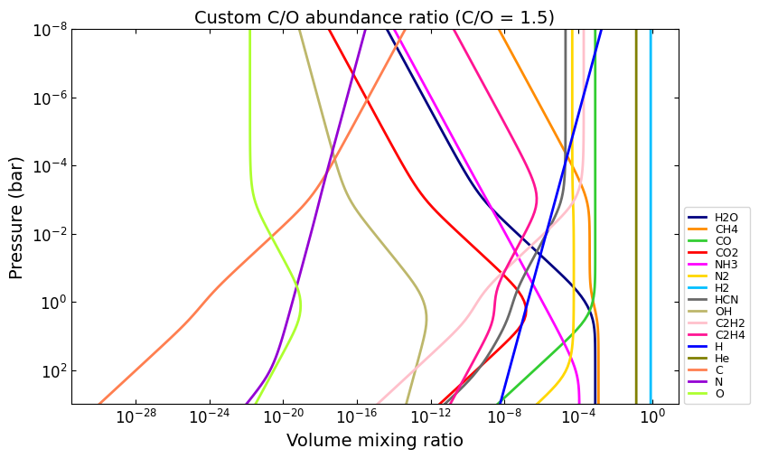

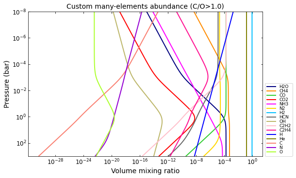

Elemental abundances relative to solar
~~~~~~~~~~~~~~~~~~~~~~~~~~~~~~~~~~~~~~

Use the ``e_scale`` argument to set custom elemental abundances as a
dictionary (values in dex units, relative to solar):

.. code:: python

    # E.g., Set 10x solar carbon, 1x nitrogen, and 1x oxygen
    e_scale = {
        'C': 1.0,
        'N': 0.0,
        'O': 0.0,
    }
    
    vmr_custom_scale_carbon = net.thermochemical_equilibrium(
        metallicity=0.0,
        e_abundances={},
        e_scale=e_scale,
    )
    
    # And plot the results:
    title = 'Custom carbon abundance (scaled 10x solar), all other 1x solar'
    ax = u.plot_vmr(pressure, vmr_custom_scale_carbon, net.species, title=title, fignum=35)

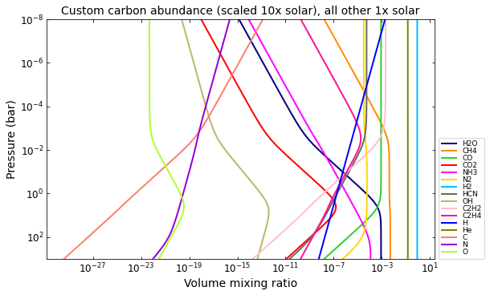

Custom elemental ratios
~~~~~~~~~~~~~~~~~~~~~~~

Use the ``e_ratio`` argument to set custom elemental abundances as a
dictionary (values are **not** in dex units, relative to a second
elemental abundance).

Note that the dictionary keys define the pair of elements separated by
an underscore. Only the first element abundance is modified, and is
scaled relative to the second element’s abundance.

.. code:: python

    # E.g., set carbon abundance to 1.5x times the oxygen abundance:
    e_ratio = {
        'C_O': 1.5,
    }
    
    vmr_custom_ratio = net.thermochemical_equilibrium(
        metallicity=0.0,
        e_abundances={},
        e_ratio=e_ratio,
    )
    
    # And plot the results:
    title = 'Custom C/O abundance ratio (C/O = 1.5)'
    ax = u.plot_vmr(pressure, vmr_custom_ratio, net.species, title=title, fignum=36)

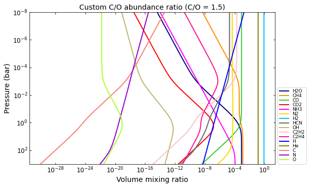

And you can combine all these properties at once:

.. code:: python

    # Custom metallicity, C/O ratio, and temperatures:
    
    # Hot, sub-solar (0.1x), C/O < 1.0:
    temp_2000K = np.tile(2000.0, nlayers)
    metal_sub_solar = -1.0
    e_ratio = {
        'C_O': 0.6,
    }
    vmr_custom1 = net.thermochemical_equilibrium(
        temperature=temp_2000K,
        metallicity=metal_sub_solar,
        e_ratio=e_ratio,
    )
    
    # Colder, super-solar (50x), and C/O > 1.0:
    temp_1400K = np.tile(1400.0, nlayers)
    metal_super_solar = np.log10(50.0)
    e_ratio = {
        'C_O': 1.5,
    }
    vmr_custom2 = net.thermochemical_equilibrium(
        temperature=temp_1400K,
        metallicity=metal_super_solar,
        e_ratio=e_ratio,
    )
    
    
    # And plot the results:
    vmr_range = (1e-20, 1)
    title = 'Custom planet 1'
    ax = u.plot_vmr(
        pressure, vmr_custom1, net.species,
        title=title, fignum=37, vmr_range=vmr_range,
    )
    
    title = 'Custom planet 2'
    ax = u.plot_vmr(
        pressure, vmr_custom2, net.species,
        title=title, fignum=38, vmr_range=vmr_range,
    )

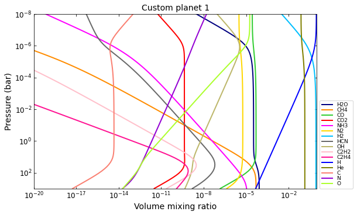

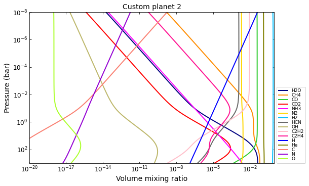

Charge conservation
-------------------

-  Charge conservation is also available, ions are specified by species
   names followed by a ``+`` or a ``-``
-  Normally, you always need to include an electron in the mix: ‘e-’

.. code:: python

    nlayers = 81
    temp = 2000.0
    temperature = np.tile(temp, nlayers)
    pressure = np.logspace(-10, 3, nlayers)
    
    HCNO_neutrals = 'H2O CH4 CO CO2 NH3 N2 H2 HCN C2H2 C2H4 OH H He C N O'.split()
    ions = 'e- H- H+ H2+ He+'.split()
    alkali = 'Na Na- Na+ K K- K+'.split()
    metals = 'Mg Mg+ Fe Fe+'.split()
    metal_oxides = 'Ti TiO TiO2 Ti+ TiO+ V VO VO2 V+'.split()
    molecules = (
        HCNO_neutrals
        + ions
        + alkali
        + metals
        + metal_oxides
    )
    
    net = cat.Network(pressure, temperature, molecules)
    vmr = net.thermochemical_equilibrium()
    vmr_range = (1e-30, 3)
    ax = u.plot_vmr(pressure, vmr, net.species, vmr_range=vmr_range, fignum=40)

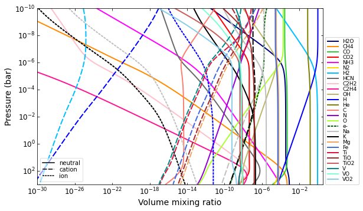

